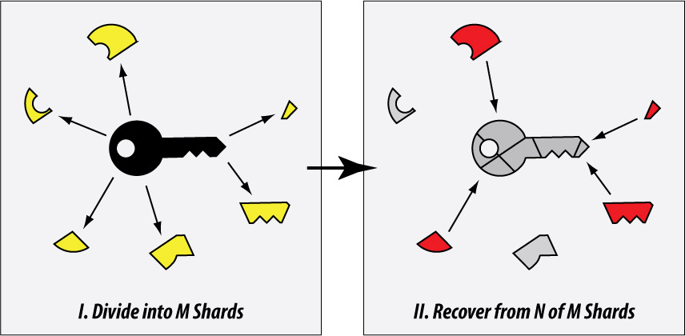
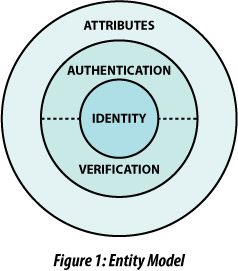
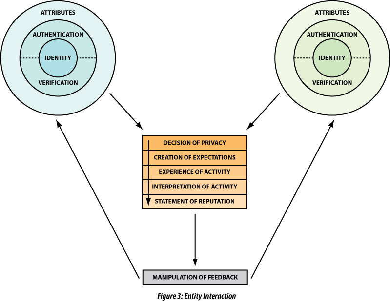

# Supporting Files

* [dpki-keysharding.ai](dpki-keysharding.ai)

* [dpki-mitm.ai](dpki-mitm.ai)

* [rebranding-fig1-entity.ai](rebranding-fig1-entity.ai)

* [rebranding-fig2-action.ai](rebranding-fig2-action.ai)

* [rebranding-fig3-interaction.ai](rebranding-fig3-interaction.ai)

  