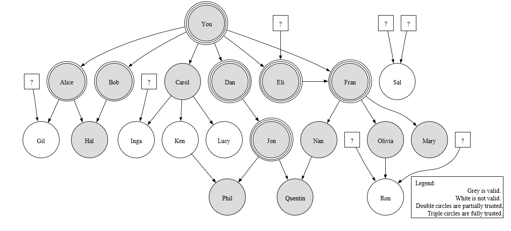
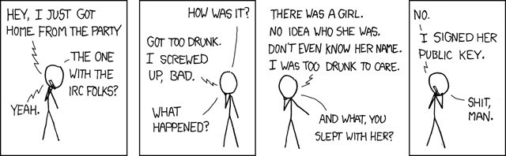

# The PGP Paradigm

#### by Jon Callas[^1] and Philip Zimmermann[^2] 

#### September 30, 2015

## Introduction

This chapter describes the mechanisms that PGP® software uses for its public key infrastructure. Much has written about PGP and practical public key cryptography. Much of this is to our opinion only mostly accurate. It is our goal in this chapter to describe the PGP models, as well as their implementation, standardization, and use. We also will put this in its historic and political context.

### History of This Document

We originally wrote this chapter for inclusion in a book on the history of PKI by our friend and colleague, Yvo Desmedt. For various reasons, the book got delayed eventually into oblivion. However, a version of this chapter was later adapted for O’Reilly Media’s book, Beautiful Security: Leading Security Experts Explain How They Think [BEAUTIFUL] and it was re-developed for that book.

Beautiful Security is a fantastic book, and we highly recommend getting it and reading it in whole. However, it was designed for a different audience than the Desmedt book — [BEAUTIFUL] is written for a more general-technical audience, as opposed Desmedt’s push to cryptography, PKI, and security practitioners. We always considered [BEAUTIFUL] to be “the Hollywood version,” as it indeed beautiful and successful, but this version to be “the Directors’ cut.” This version contains a number of updates to the original article, including this section.

### PGP and OpenPGP

PGP started off as software. It became a protocol, a standard, and four companies. So naming wasn’t planned, it happened. When the IETF created a standard, we called the standard OpenPGP. We, along with the IETF, chose the name OpenPGP for the standard, as it descriptive and not a trademark. The terms PGP, Pretty Good Privacy and Pretty Good became trademarks. Presently, Symantec Corporation owns them.

The software PGP became a set of software products, many of which did not use the OpenPGP protocols at all, including disk encryption, file encryption, network encryption, and more on both client systems and servers. There became a number of open-source toolkits and programs, the most well-known of which is GNU Privacy Guard.

Additionally, PGP is one implementation of many implementations of the OpenPGP standard. But much of the PGP story predates the OpenPGP standard, and there is no defined term to separate the pre-OpenPGP software from the pre-OpenPGP protocol.

The core OpenPGP protocol is defined in the IETF RFC 4880 [RFC4880] and RFC 3156 [RFC3156]. The early PGP protocol is defined in RFC 1991 [RFC1991]. There is presently a reformed working group in the IETF that will no doubt create updates to these documents.

Consequently, we will use PGP to refer primarily to this early software, and RFC 1991 to refer to the early protocol.

### Historic and Political Context

### Terminology Notes

PGP has its own terminology that parallels other public-key infrastructure. This terminology is intentionally colloquial.

•	We use the term PGP key to denote a certificate. Whitfield Diffie coined this term, choosing it because it is easier to say, type, and understand than certificate. The average person can intuit what a key is and what it is used for, but cannot intuit a certificate.

Today, the term can be confusing in some contexts. A PGP key (certificate) can contain many certifications, and in fact many related public keys, each governed by their own contexts and policies.

•	A keyring is merely a collection of keys. The earliest keyring was simply a file containing a set of keys. A keyring may be a private database that a user has, but a keyring can be shared among a number of users. In fact, there are also keyservers that are network directories of a large collection of keys.

•	Sign is another early term picked because it is colloquial English. We use the term to sign a key to mean that it is certified. For example, if Alice [ALICE] signs Bob’s key, that means that Bob’s key holds a certification signature created by Alice’s key.

•	The term introducer is used to denote a key that creates a certification, a signature that states that a key and user information belong together. Thus, an introducer is the same thing as a certificate authority. Like the term key, Whitfield Diffie coined the term introducer as a more colloquial and human term than certificate authority.

#### Early PGP

Zimmermann began working on some of the early designs of PGP when he was a peace activist in the 1980s during the Nuclear Weapons Freeze campaign. The world was a different place then. Reagan was in the White House, Brezhnev was in the Kremlin, FEMA was telling cities to prepare evacuation plans, and millions of people feared the world was drifting inexorably toward Nuclear War. A million Americans marched for peace in Central Park.

It was in that political climate, in 1984, that Zimmermann saw the need to develop what would later become PGP, both for protecting human rights overseas, and for protecting grassroots political organizations at home. He started on the early design of PGP, but the more pressing matters of the peace movement postponed the bulk of the development effort until years later.

Zimmermann wrote the first working version of PGP in 1991. He wrote PGP in the wake of Congressional discussion[^3]  of requiring that all communications equipment and services have a “trap door” in them to permit government anti-criminal and counterterrorism activities.

While that discussion passed with no legislative outcome, Zimmermann rushed to produce PGP 1.0 so that there would be freely-available strong encryption in wide distribution while it was still legal to do so. One of PGP’s explicit design goals was to metaphorically shoo the horses out of the barn before the door was closed.

While there were other message-encryption systems at the time, notably PEM (Privacy Enhanced Mail), they were so tightly controlled that PEM was not suitable for mass deployment [^4].

PGP 1.0 captured the attention of many people, but was flawed. In particular, it used the “Bass-O-Matic” cipher designed by Phil Zimmermann, in which Eli Biham found cryptographic flaws. So Zimmermann, along with Hal Finney, Peter Gutmann, Branko Lancaster worked on its successor version, PGP 2.0.

 

PGP 2.0 replaced the Bass-O-Matic cipher with the IDEA (International Data Encryption Algorithm) cipher, designed by Xuejia Lai and James Massey. It also introduced the PGP trust model in a state that was close to its RFC 1991 form.

PGP 2 captured the imagination of many people who wanted to use strong cryptography in an ad-hoc, unregulated environment. It became a grass-roots phenomenon.

#### Patent and Export Problems

While cryptographically quite strong, PGP 2 had other issues, dealing with patents and export control. While secure, the IDEA cipher was patented. The patent owner, Ascom-Tech AG, licensed it freely for non-commercial use but had inconsistent licensing for commercial users. The RSA public-key algorithm was patented in the United States, the patent owned by MIT, and licensed to RSA Data Security Incorporated (RSADSI).

Phil Zimmermann met in 1986 with RSADSI’s CEO, Jim Bidzos, and discussed licensing the RSA algorithm for freeware. Those meetings ended with Zimmermann believing that he had permission to use the RSA algorithm in software so long as its cost was zero (i.e., that it was true freeware), and Bidzos believing the opposite. Years of disagreement about this agreement followed. Part of the difficulty in the legal status of PGP included the fact that the RSA algorithm was patented only in the United States, but no other country and that the actual owner of the RSA patent, MIT, was favorably disposed to PGP software.

The end result was RSADSI creating a library, RSAREF, for use in freeware and shareware, and PGP software being released in a version 2.5, that used RSAREF in the US, but broke compatibility with all previous versions. This meant that there were several versions of PGP:

1.	The pre-PGP-2.5 versions of the software that were cut off from future development and support.

2.	An “international” version of PGP software, developed completely outside of the United States (for export-control reasons), that used the original implementation of the RSA algorithm.

3.	An “RSAREF” version of PGP software, developed inside the United States, using the RSAREF implementation of the RSA algorithm.

In all of these versions, the IDEA cipher was free for use non-commercially, but not for commercial purposes.

While the intellectual-property disagreements were going on, Public Key Partners filed a complaint in 1992 with US Customs, complaining that Zimmermann was exporting cryptography without the appropriate licenses, namely the PGP program, which by then had spread throughout the Internet. That started the notorious investigation of Phil Zimmermann and PGP software. The investigation lasted until January, 1996, when it was dropped.

There are many misconceptions about l’affaire Zimmermann which we can correct.

Zimmermann was the target of a criminal investigation, but was not prosecuted. No criminal charges we filed against him or anyone else about PGP. Nor were there any lawsuits filed, nor any other legal action other than investigation. Nor did anyone spend any time in prison. The investigation itself covered the actual distribution of the PGP software itself, and not the PGP team’s development practices. The PGP team consisted of developers in the United States, New Zealand, and Europe. While some of these developers were questioned about the software distribution, the practice of developing software internationally was apparently never the subject of the investigation.

The US government (in particular the NSA) did not start the investigation in response to the software’s existence. The popular misconception is that somehow the government did not like mass-dstributed cryptography, and therefore started the investigation. The investigation was conducted by US Customs in response to the RSADSI complaint. While the NSA was consulted in the matter, they apparently did not start it, and there is evidence that they were instrumental in dropping the investigation [CROWELL].

#### The Crypto Wars

Part of the political context of the 1990s was what is often called The Crypto Wars. The Crypto Wars were the result of the changing role of cryptography in society. Until 1997, international regulation considered cryptography a weapon of war. Free and open cryptosystems were regulated as munitions in the United States, banned in France, and of mixed status throughout the world. In 1997, the US reclassified cryptography as a dual-use item; France opened up nearly all cryptography in 1999; export controls on cryptography were radically liberalized in 2000. Those liberalizations have continued since then despite international concern about terrorism.

Part of the struggle to end the US export controls on crypto involved the publication of PGP source code in its entirety, in printed book form. Printed books were and are exempt from the export controls. This happened first in 1995 with the publication of the MIT Press book, “PGP Source Code and Internals” [PGP2] [PGP2S]. It happened again later when Pretty Good Privacy Inc. published the source code of PGP in a more sophisticated set of books with specialized software tools that were optimized for easy OCR scanning of C source code. This made it easy to export unlimited quantities of cryptographic source code, rendering the export controls moot, and undermining the political will to continue imposing the export controls.

Since then , there has been nearly an about-face in government attitude about cryptography. National and international laws, regulations, and expectations about privacy, data governance, and corporate governance either imply or require the widespread use of strong cryptography. In 1990, the cultural attitude about cryptography could be described as, “Why do you need that? What do you have to hide?” Twenty years later, the cultural attitude is closer to, “Why don’t you have it? Don’t you understand that you have to protect your data?”

The definitive history of The Crypto Wars and the cultural shift in cryptography has not yet been written. Nonetheless, a good place to start is Steven Levy’s Crypto [LEVY].[^5]

#### PGP 3 to OpenPGP

After the fate of PGP 2 became calmer, Zimmermann, along with Derek Atkins and Colin Plumb, started work on a new version of PGP software, PGP 3. PGP 3 contained a number of improvements to the RFC 1991 protocol including:

•	Support for multiple public key pairs in a PGP key. In particular, its design called for separate signing and encryption keys, as a way to enforce key use.

•	Support for DSA public-key signatures, as well as Elgamal for public-key encryption.

•	Support for CAST5 and Triple-DES for symmetric encryption.

•	Replacing the MD5 hash function with SHA-1, after Hans Dobbertin found pseudocollisions in its compression function [DOBBERTIN].

In 1996, Zimmermann formed the company Pretty Good Privacy, Inc. with private investors and the company Viacrypt, which had produced commercial versions of PGP software. Since Viacrypt had released versions of the RFC 1991 system under the product name PGP 4, the PGP 3 cryptosystem was released as PGP 5.

At the time, members of the PGP software development team started to advocate a profile of the PGP 3 protocol they informally called Unencumbered PGP, a set of parameters that eschewed algorithms encumbered with intellectual property. The team took Unencumbered PGP to the IETF as a successor to RFC 1991, and it became OpenPGP.

We hope this helps explain PGP and the world that created. Let’s talk about the the real point of this chapter, the PGP trust model.

 

in the public sphere, but the anti-cryptography discussions are coming from law enforcement, rather than the intelligence organizations. Colloquially, it’s being called “Crypto Wars II” and the discussions haven’t really changed. What has changed is that crypto is already used everywhere for protecting data, stopping crime and espionage and that in a multinational environment, this isn’t likely to change. Despite a new request coming nearly every week for some way for crypto to work only for the good guys, the consensus from those who know is that this can’t be done.

 

## Trust Models

#### Trust, Validity, and Authority

Trust is a funny word. It means many things in many contexts. In this discussion we will use a narrow, strict definition. Trust is the mechanism that use to decide that a key is valid. A key is valid if it is actually owned by the person who claims to own it. In other words, if the descriptive information traveling with the key is accurate, then the key is valid. You tell PGP whom you trust, in return PGP tells you which keys are valid.

Thus, if a key that says it is owned by the same person who owns the email address, "Alice" <alice@example.com>, then that key is valid (or accurate). If Bob believes the key is valid because Charlie signed that key, then Bob considers Alice’s [ALICE] key valid because he trusts Charlie.

A Trust model is a broad scheme that we use for trust. Let’s look the basics of trust models.

#### Direct Trust

Direct trust is the most straightforward type of trust. In direct trust, Bob trusts that a certificate is Alice’s because Alice gave it to him. It is the best trust model there is, so simple that we described it without giving it a name. It is not only the simplest trust model, but at the end of the day it is the most – well, trustworthy!

People use direct trust all the time by doing things like putting an OpenPGP key fingerprint (which is itself a hash of an OpenPGP key) on their emails or business card. Even simpler, if I mail you my key, we’re using direct trust. You trust that the key is valid because I am only hurting myself to be wrong.

Often in a direct trust system, a certificate that holds the key is signed by that certificate itself. That is to say that it is self-signed. Self-signing is useful because it provides a consistency check. We know that a self-signed certificate is either wholly accurate or wholly inaccurate.

The only problem with direct trust is that it doesn’t scale very well to something the size of the Internet. That doesn’t mean it’s not useful, it just means it doesn’t scale.

#### Hierarchical Trust

Hierarchical trust is also straightforward. In hierarchical trust, you trust that a certificate is valid because it was signed by someone whom you believe to be accurate, as in the example we above. Bob considers Alice’s certificate to be valid because Charlie signed it. Bob trusts Charlie to be an authority on accurate signing.

There are a good number of companies that make it their business to be Charlies. GoDaddy and VeriSign, to name two, are widely trusted Certificate Authorities, and they are trusted because of the practices they follow in creating certificates. Part of these practices are that they have a relatively few number of keys that extend this trust. These keys are themselves held in Root Certificates (which are self-signed certificates). The key in this root certificate signs a key in another certificate. This can extend some number of times before we get to the actual certificate we’re interested in.

To verify that certificate, we trace a chain of certificates. Alice’s certificate is signed by a certificate that is signed by a certificate that is signed by the certificate that Jack built. Many large corporations, governments, and so on have their own hierarchies that they create and maintain.

X.509 certificates of the sort that we use for SSL connections on the web use hierarchical trust. If you go to Amazon.com, that web server has a certificate that was signed in a hierarchy that traces up to a root certificate that we trust. For these commercial certificate authorities, they typically use a depth of two or three.

Ah, we hear you ask, “But how do we trust that root certificate?” The answer is: direct trust. Built into your web browser is a set of root certificates. You consider them valid because they are part of the software you installed. This is an important point, that hierarchical trust ultimately derives from direct trust.

Hierarchical trust is straightforward, but has an obvious risk. If the authority makes a mistake, the effect of that mistake is great. In a notorious example of this problem, Microsoft uses a hierarchical trust system for its code-signing system, Authenticode. That hierarchy is maintained by VeriSign. A few years ago, some miscreants convinced VeriSign that they were Microsoft employees, but they were not. VeriSign issued Microsoft code-signing certificates to people who were not Microsoft. Fortunately, the scam was caught quickly. Had they gotten away with the improperly-issed certificates, whoever ended up with those certificates would have been able to sign software with a Microsoft key, and as far as the system works, that bogus software would have been Microsoft software.

#### Cumulative Trust

The drawback of hierarchical trust — that a hierarchy is brittle — leads us to the last major trust model, that of cumulative trust. Cumulative trust takes a number of factors into consideration and decides if a certificate is valid based upon these factors.

Cumulative trust comes from an examination of the limitations of the hierarchy. In an idealized world, hierarchical trust works best. When everything goes right, hierarchical trust works best. We use hierarchical trust in the real world all the time. Passports, visas, drivers licenses, national identity systems, credit cards, and even an employer’s credentials are all done through a hierarchical trust system.

However, the prime impulse of a security person is to look not at what can go right, but at what can go wrong. Hierarchies are brittle; because they are brittle, there is a natural tendency to limit the scope of a hierarchy. In general, passports and drivers licenses are not unified, for example. Government documents rarely become credit documents. And because they are brittle, different hierarchies tend to look askance at each other. The badge that gets you into your workplace cannot get you onto a plane, despite a chain of trust! The badge comes from a hierarchy at your employer that is backed by identity documents into the banking and tax systems. At least in theory, they could be tied together. They are not tied because of a lack of trust between the hierarchies.

The simplest cumulative trust system is the question, “may I see two forms of ID, please?” The two forms of ID are a cumulative trust system. The security assumption is that it is much harder to have two erroneous trust paths than one. That idea, that the relying party collects at least one trust path, makes it cumulative. The accumulation might also use different types of trust. For example, when you give a merchant your credit card and the merchant asks to see your drivers license as well, that is also cumulative trust. Note that the credit card is a financial credential, and the drivers license is a quasi-identity credential[^6]. The merchant, however, accumulates the trust from the two credentials, and completes the transaction.

Note that cumulative trust can encompass both direct trust and hierarchical trust. It is easy to set up in a cumulative trust system both direct trust and hierarchies of trust. We can also consider a hierarchy to be a special case of a cumulative system where we accumulate to one. Direct trust is also a special case of both a hierarchy and accumulation.

In public key infrastructure, the most widely used cumulative trust system is the PGP Web of Trust. However, cross-certification and bridge CAs are closely related to cumulative trust, if not precisely and accumulation system.

## The Basic PGP Web of Trust

For those who are familiar with other PKIs, PGP differs from the basic, hierarchical system with one tweak that everything else derives from. In the PGP trust model, all users are also certification authorities. Of course, not all authorities are created equal. Alice can certify Bob, but that doesn’t mean Fran should accept the certification. This is why PGP uses the term introducer instead of authority. We have a natural tendency to trust an authority, but we attach realistic skepticism to an introduction.

“Phil, this is Bob,” says Alice, making the introduction. Based on how accurate Phil thinks Alice is, he makes a decision. Phil can fully trust Alice as an introducer, and accept Bob as valid. He can also wait until Jon says, “Hey, Phil, have you ever met Bob?” before he truly accepts the other person as accurately Bob.

There is a common misconception that since the Web of Trust is relativistic, in that all frames of reference are equally valid, that there can be no recognized authorities and no organizational use. To think this is to confuse architecture and implementation. Many implementations and deployments hand a group a set of introductions to the end users, and they use them, the same way they accept the root certificates baked into other software.

But to understand the way it works, let us examine Figure 1, which shows the Web of Trust and all its facets. Each node in Figure 1 is a key in a keyring. Each arrow represents a certification signature. An arrow going from Alice to Bob means that Alice has signed or certified Bob’s key.

\
**_Figure 1: The PGP Web of Trust._**

At the top of Figure 1, the key labeled You is the owner’s key. It is a circle to denote that it is trusted, in fact a double circle to denote that it is fully trusted, which means that any key it signs will be valid. We also say that it is implicitly trusted, because you hold the private key as well as the public key. There are arrows that indicate that you have signed the keys belonging to Alice, Bob, Carol, Dan, Eli, and Fran.

There are also signatures that are dangling references to keys that are not in this keyring. For example, some key that you don’t have has signed Eli’s key.

The keys on the graph that are filled with grey are keys that are valid; we consider them accurate because the cumulative system of the Web of Trust calculates that they are valid. The accumulation works as follows: partially trusted introducers are denoted in the graphy Mauer’s Variant of the Web of Trust

by a key with a circle, and they score one point; fully trusted introducers are denoted in the graph by a key with a double circle, and they score two points. If a key scores two or more points, it is considered valid. Keys with zero or one point are not considered valid.

Let us look at some specific subgraphs:

•	Alice and Bob have each signed Hal. Therefore, Hal is valid, but Hal is not trusted.

•	Gil is signed by Alice, but you only partially trust Alice, and so Gil’s key is not valid.

•	Carol has signed a number of keys that are also in this keyring, but none of them are valid. Interestingly, Ken signed Phil, which is valid, but not because Ken signed it.

•	There is a tight cluster of keys with Dan, Eli, and Fran. You have signed each of them. Also, they are all fully trusted introducers. Eli’s signature on Fran’s key is redundant, because you directly certified it. Or perhaps your direct certification is redundant because Eli signed it.

•	Nan, Olivia, and Mary are valid because Fran signed them. If we trace up the from any of them, we see that there are two validity paths, one including Eli and the direct path from Fran to You.

•	While you consider Jon valid because Dan signed his key, you also fully trust him. Consequently, Phil and Quentin are valid. Any other keys you discover that Jon signed are also going to be valid. This is, of course, true of the other fully trusted introducers, but Jon is someone you haven’t directly trusted. The pair of Dan and Jon very closely resemble a hierarchical certification authority.

•	Also note that while there are two upward paths from Quentin, one of them goes through Nan, who is valid but not trusted. Thus, while Nan has two upwards paths of validity, Quentin only has one.

•	While Ron has four signatures, none of them are from people you trust.

•	Sal is signed by two dangling keys.

#### Mauer’s Variant of the Web of Trust

The cryptographer Ueli Maurer [MAURER] developed an extension to the PGP Web of Trust that allows for a continuous scale of trust assignments. In his model the usual PGP scale would be zero, one-half, and one with validity granted when enough trust accumulates to get to one. However, he permits any fraction to be assigned to an introducer. You can have one introducer given a value of 0.9, and another of 0.15.

#### Revocation

All PKIs need a way to revoke certificates. Users are fallible creatures and they lose control of computers and keys. Systems can be lost or compromised, and the keys and certificates have to be declared invalid before they expire.

A simple, hierarchical PKI such as the usual X.509 system has one mechanism, objects that note that the certificate is not valid. The Web of Trust has two mechanisms. The first is a signature revocation. A key can create a signature that states that a given signature is no longer valid. This works for all forms of signatures, including data signatures as well as certification signature. With this, Alice can revoke her certification of Bob’s key.

However, since a PGP key is a certificate that holds more than one certification, there must be a way to declare the entire object. The second form of revocation revokes the key itself in its entirety. This is a signature that the key makes declaring itself no longer valid. A revoked key has all its certifications invalidated.

#### Rough Edges in The Original Web of Trust

The basic Web of Trust works very well as a cumulative trust system. However, there are a number of architectural and semantic rough edges in it. We fixed these rough edges in later versions of PGP, but we will review them here first.

#### Supervalidity

In Figure 1, Fran is a special key, in that she has a score of four — two from being signed by You and two from being signed by Eli. The Web of Trust makes no allowance for super-valid keys, yet intuitively there should be something about Fran. There should also be something about a key that both Fran and Jon signed. We have yet to turn that intuition into useful mechanism.

#### Trust and Validity

Most people confuse trust and validity. Even those of us who know the Web of Trust best sometimes make mistakes. Validity is only a score, and that score means we accept that the name on the key is accurate. Validity is thus a quality of a node. Trust is a quality of the edges going from a node, and only applies to valid nodes. It is through the trust paths that we determine validity. And yet, we talk about trust and the introducer, and thus it is easy to confuse trust and validity.

 

#### The Social Implications of Signing Keys

What does it mean to sign someone’s key? Does it mean you like them? Does it mean you think they are a good person? Over the years, many of us have debated this. We have phrased the central question as, “Should Dudley Do-Right (a cartoon hero) sign Snidely Whiplash’s (a cartoon villain, and Dudley’s nemesis) key?”

Strictly, a signing a key means only one thing — that you believe it belongs to that person. The answer to the question is that yes, Dudley should sign Snidely’s key, because that means that Dudley’s allies can more readily know that a key is Snideley’s.

Despite this, many people are uncomfortable signing a key that belongs to someone they don’t like.

Assigning trust can also be thorny from a social aspect. Still looking at Figure 1, suppose that in real life, you trust Carol with your life (suppose she’s your best friend), but you don’t trust her to sign keys accurately, particularly because of her trusting nature. Web-ofTrust trust is a specialized trust, not real-world trust. Similarly, Fran may be a picayune, anal-compulsive nit-picker whom you can barely stand to be in the same room with, but you made her a fully trusted introducer for this very character flaw.

Nonetheless, signing someone’s key can be a very personal thing. Many people feel very strongly about it. Part of the strength of the Web of Trust is that this personal touch is part of PGP’s zeitgeist. But it can also be a weakness that something so very simple — stating that you believe someone is who they claim to be – can become so emotionally charged. That’s why Figure 2, from Randall Munroe’s [xkcd] comic strip is so funny. For many people, certifying a key is an intensely personal thing.

\
**_Figure 2: “Responsible Behavior”, from [xkcd]_**

#### Signatures as Friction on Upgrades

An related emergent property of the Web of Trust is that key signatures acquire a cachet to them. They become like autographs. They have social value.

Some of this social value is simply operational. If you have gone to the trouble to get several people you value to sign your key[^7], then if you get a new key, you have to get all of those signatures again. There are many people who keep their key for longer than they should because they have an emotionally evocative key signature.

This basic problem even applies to your own keys. There is presently no way to automatedly roll-forward the validity of your 1998 key to your 2008 key. If the old key signs the new key and vice-versa, this creates a manual a roll-forward that is supported in the trust model, but it is not automated, and requires people to have both keys.

#### Signature Management Policies

PGP software systems typically agglomerate signatures on keys. It is easiest, and most often correct to simply accumulate the signatures. However, there are three basic cases where this is not desired.

1.	Replacement signatures. If a new signature supersedes an older one, then the older signature should be thrown away. For example, let us suppose that Alice signs Bob’s key in 2007 with an expiry of 2008. Suppose that in 2008, after the first signature expires, she signs Bob’s key again, with an expiry in 2009. It seems that the 2008 signature should replace the 2007 one. However, it is not always clear what makes a signature a successor to a previous one. It is also not clear in the basic Web of Trust if the signature that was superseded should be deleted, or if it should be kept as an historic record.

2.	Expired signatures. Consider the previous case, but let us suppose that after Alice’s first signature expires, she had not yet created a new one. Should we delete the signature from Bob’s key? An expired signature is not included in trust calculations, so why not delete it? The basic Web of Trust does not address this, and in general, software did the lazy thing and kept all expired signatures.

3.	Unwanted signatures. Suppose Bob doesn’t want Alice’s signature on his key. There are a number of reasons Bob may not want Alice’s signature. Perhaps he has no idea who she is[^8]. Perhaps Bob despises Alice and wants no reminder of her. It is, after all, Bob’s key.

There are two other issues related to this. In the Dudley/Snidely case, Dudley wants to sign Snidely’s key for the public good, and understandably Snidely doesn’t like this. There is a conflict between Snidely’s control of his own good and the public good at large. It is hard to come to some reconciliation of this conflict without bringing back in to signing the sort of value-based policies that we so carefully excised.

The second issue is that the basic Web of Trust provides no authentication of a signer.

Let us suppose, for example, that the Dudley signature on Snidely’s key comes not from Dudley, but from Boris Badenov (another villain), who has created a false Dudley key strictly for the purpose of annoying Snidely.

We call this last case signature harassment. In the days of PGP 3 to OpenPGP’s definition, we discussed signature harassment internally, but never published any of these discussions because it was so easy to create, and so hard to guard against, because of the agglomerating policies of that generation of keyservers.

As noted, the basic original Web of Trust did not address these points. As we will explain, we fixed these in later versions of PGP.

#### Key Revocation and Expiry

Key revocation is a rough edge in all PKIs. It is perhaps the sharpest rough edge of all public key cryptography. While the PGP model is flexible and avoids some revocation pitfalls (such as the tendency of Certificate Revocation Lists to grow monotonically to unmanageable size), it has its own issues with revocation. Here are some of them:

•	There is no mechanism to distribute revocation information out of band of the keys themselves. If Alice revokes her key, she can place the revoked on a keyserver, but there is no way to broadcast this mechanism to everyone who has her key.

•	There is no way for someone to revoke a lost key. It is not uncommon for a new PGP user to create a key, upload it to a keyserver, and then promptly forget the passphrase that protects it. There is no way for someone who has genuinely lost a key to issue a cryptographic revocation of that key.

•	There is no semantic guidance about revoked or expired keys. For example, let us suppose that Alice creates a key in 2002 that expires in 2006. Suppose that she signs a document in 2003, and revokes her key in 2005. In 2008, what do we do with that signature? Certainly, in 2003, that signature was good, but is the signature still valid after she revokes her key?

Of course, it depends a lot on why she revoked her key. If she revoked because she created a new one, the signature is still good. If she revoked it because identity thieves stole her laptop and wrote bad checks, then that signature should be considered a forgery, as there’s no way for us to distinguish it from a forged, backdated signature[^9].

These difficulties meant that keys were rarely revoked, except in obvious cases of key loss. At least in theory, it should be easy and desirable to revoke a key because it was superseded with a new key, or was otherwise retired. But because revocation was always looked upon with the worst case scenario — that the key had been truly compromised — users rarely revoked keys.

A way to avoid revocation is to use expiry instead. PGP allows for keys to expire. The expiry date of a key is held in a self-signature, and this adds some additional flexibility, because the expiration can be rewritten simply by the key holder simply creating a new self-signature. Expiration, then is not irrevocable. Unfortunately, people rarely used the expiration features.

#### Social Networks, Traffic Analysis

Many people have observed the Web of Trust forms a social network, a generalized directed graph, that shows connections between people through their keys and signatures. This graph can be analyzed for social connection information, to some effect or other.

If a given person subscribes to the theory that their signatures should be value-neutral, or even that they make a point of signing “hostile” keys (such as Dudley signing Snideley’s key), someone cannot assume a relationship between two people based upon the existence of a key signature. Also, PGP “key signing parties” in which a number of people get together and collectively certify each others’ keys blur the semantic meaning of the social network.

Nevertheless, the Web of Trust’s directed graph says something about the people in it. What it says, though, is open to both analysis and debate.

#### Orthogonal Graph-Theoretic Analysis

There have been a number of analyses of the Web of Trust digraph.

Neal McBurnett [MCBURNETT] analyzed the network structure of the Web of Trust digraph. He examined the digraph for path lengths, connectedness, degree of scale, and other features.

Mark Reiter and Stuart Stubblebine created PATHSERVER[PS1] [PS2], a way to evaluate multiple signature paths between keys.

These analyses are inspired by the Web of Trust and derive from the Web of Trust, but we must note that they are orthogonal to the Web of Trust proper. It is an integral feature of the Web of Trust that it consists of viewpoints; it may be considered relativistic, in that no frame of reference in the Web of Trust is inherently more valuable or trusted than any other. The trust portion of the Web of Trust relies completely on the user-specific trust markings and the weights that the key holder places on keys. The mesh of keys is an interesting object

 

that we believe is useful on its own, and helps the overall use of the Web of Trust, but it is an orthogonal construct to the Web of Trust.

#### Scaling Issues

In its basic form, the Web of Trust scales excellently at the low end. It excels with handfuls of people up to the small numbers of thousands. Inside a single organization, it even scales to tens or hundreds of thousands of people.

However, large, disconnected networks of people may find it difficult to use the basic Web of Trust because there are few paths between people who do not already know each other. As the Web of Trust includes more nodes with relatively few edges, finding trust paths becomes difficult. Nonetheless, it is also important to remember the power of direct trust. If Alice has no connections to Zeke, she can always just ask him to send her his key.

## The Extended PGP Web of Trust

As we recognized the limitations of the basic model, we added in new elements to improve the scaling and smooth the rough edges. The features we describe below were added to the basic Web of Trust to address many of the rough edges we described above.

### Designated Revokers

A designated revoker is a second key that has rights to generate revocation signatures for a primary. A revocation coming from the designated revoker is as valid as one coming from the primary key itself.

Suppose that you designate Dan to be your designated revoker. When you do this, there is a self-signed signature in your key that states that Dan is your revoker. Additionally, this signature is itself marked as a irrevocable signature. The designation of a revoker must be irrevocable, because in the case of a true key compromise, the compromiser could otherwise just revoke the revoker[^10].

The designated revoker need not be an active key. You might, for example, create a key specifically to be your revoker and store it offline in a safe, where it will remain unless and until it is needed. The designated revoker feature provides a great deal of resilience against lost private keys, forgotten pass phrases, or compromised keys. Everyone should define a designated revoker for their key

Designated revokers first appeared in PGP 3, and are a part of OpenPGP.

### Reasons For Revocation

As we noted above, there are many reasons to revoke a key, but only the most dramatic reason was denoted in the Web of Trust. Starting with OpenPGP, there is a way to annotate a revocation signature to state if the revocation is for key retiry, key compromise, or if the key has been superseded by a new key. This annotation can even include a human-readable string.

### Exportable Signatures

One of the main causes of signature bloat is the mechanics of importing keys. If Alice wants to import Phil’s key and consider it valid, she is likely to need to sign it herself. If she accidentally (or intentionally) sends Phil’s key back to a keyserver, it will have her signature on it.

A good way to stop this is to differentiate between signatures someone makes for their own purposes and trust calculations and signatures that someone makes as a public statement of certification. The latter are exportable signatures, and the former are non-exportable signatures[^11].

When a software implementation exports a key, or sends it outside its own scope of control, it strips all non-exportable signatures. Also, when an implementation imports a key, it also strips non-exportable signatures.

This allows the Web of Trust to differentiate between certifications made for the world at large, and certifications that exist to build a cryptographically secure set of valid keys for a given person.

Exportable signatures first appeared in PGP 3, and are a part of OpenPGP.

### Extended Introducers

Extended introducers, also called meta-introducers, are a way to improve the scaling mechanisms of the Web of Trust through multi-level hierarchies embedded in the Web of Trust. The basic Web of Trust already supports multi-level hierarchies, but each signing node in the tree must be given trust. Extended introducers can automatically introduce introducers to a specified depth. If we examine Figure 1 again, let us presume that Dan is given a metaintroducer signature with a depth of 1. With this trust signature, Jon’s is automatically a fully trusted introducer with no further signature. So is any other key that Dan signs.

### Key Editing Policies

Note that this gives Dan great power, the same as a root certificate authority with one level of delegation. In the real world, individuals are rarely given such power, but consider an organization broken up into departments. If a top-level key for the organization is given a meta-introducer signature, and that key signs department keys, then the departments automatically trust each others keys without further interaction.

Extended introducers first appeared as part of OpenPGP.

### Key Editing Policies

One of the rough edges of the basic Web of Trust is keys acquiring a bloat of signatures, especially on key servers. OpenPGP introduced two key editing policies that the key owner can announce to a keyserver.

The first key editing policy is a request to the server that it permit only edits that have been authorized by the key owner.

The second editing policy is a request to the server that rather than agglomerate the union of all key signatures, that the server replace the old copy of the key with the new copy, rather than construct the union of the two.

These two policies permit a key owner to have control over which signatures are on the key. Alone, the first policy agglomerates signatures, but only under the owners control. The first and second policy together give the key owner complete control over how their key is presented.

An addition to these policies is a URI embedded into the key that states where the definitive copy of the key resides. This can be a server, or even a file accessed by http or ftp. This URI permits a key owner to direct the world of users to a definitive copy of the key. The definitive copy helps the owner distribute revocation information as well. If the URI points to a keyserver, it also helps with signature revocations, as well.

All of these policies reside as attributes of a self-signature, and therefore a key can have different policies for each user ID on the key. These policies first appeared as part of OpenPGP.

### Freshness

Freshness is an alternative way to manage expiry and revocation. Freshness-based systems use standard expiration and revocation, but de-emphasize revocation over expiration. [RIVEST]

Consider a key holder that creates a key that will expire in two weeks, but recreates the expiration signature every week. This holder has unilaterally constructed a freshness-based In-Certificate Preferences

system. Their need for revocation is minimized, since any given copy of their key expires in two weeks or less. In many cases, freshness can permit a holder to ignore revocation completely and rely on expiry.

Key signers can also use freshness-based systems to avoid revocation on their signatures as well.

Note, though, that freshness requires the signers to continually update their signatures. It also requires more rigorous policies in superseding replacement signatures.

Freshness-based OpenPGP systems were first described in [SAPKI].

### In-Certificate Preferences

While not strictly part of the trust model, OpenPGP introduced an important feature that it codes a number of user preferences in the self-signature of a key. OpenPGP is highly parameterized, with a number of options. For example, there are a number of options on symmetric ciphers, compression functions, and hash functions.

OpenPGP permits users to state their preferences in an ordered list of values for each option that is placed in the user’s self-signature.

This has a number of desirable features. It is an authenticated store of a user’s options and allows two implementations of OpenPGP to resolve differences of opinion between users. This is so useful that X.509 standards are in the process of adding their own in-certificate preferences.

### The PGP Global Directory

The PGP Global Directory is a revised LDAP-based keyserver that improves upon previous generations of keyservers through improved authentication and key editing.

•	The Global Directory requires a key submitted to it to be authenticated via an email round-trip. The Global Directory sends an email message with an authentication URL to all supplied email addresses. Only if the Global Directory is re-visited via an authentication URL, then the key will be placed in the directory.

•	The Global Directory permits only one key per email address. This is not a perfect solution to key bloat. There are many cases where a key holder could have more than one legitimate key for a specified email address. However, in this case, there is a secondary problem in how third parties decide which key to use. The oldest? Newest? Both? Listing only one key does not address this issue to everyone’s satisfaction, but it does address it.

### Authoritative Keys

•	The Global Directory permits the holder of an email address to delete a key for that email address via an email round-trip authentication, similar to adding a key.

•	The Global Directory requires that a key be re-verified semi-annually. It sends each key an update email, and if there is no response to the email, the corresponding key is removed from the Global Directory.

•	The Global Directory implements the OpenPGP key editing policies described above.

•	The Global Directory signs each key it holds with its own certification key. These signatures use freshness on a two-week interval. Thus, if a user deletes or revokes their key, a there is at most a two-week certification from the Global Directory. This permits the Global Directory to forego its own revocation mechanisms.

These operational policies improve the accuracy of the PGP Global Directory; its users know that every key on it was authenticated via an email exchange between the Directory and the key holder sometime in the last six months.

Note that some of these policies still have the potential for abuse. For example, Boris Badenov could update Snidely Whiplash’s key periodically for no reason other than to annoy him. These issues are addressed through appropriate software that throttles requests, and uses other anti-harrassment mechanisms such as those that anti-spam software uses.

The Global Directory is a consolidation of a number of ideas that circulated in the OpenPGP community, including:

•	The Robot CA, first proposed by Phil Zimmermann, and written about by Seth Schoen [SCHOEN], and then refined and implemented by Kyle Hasselbacher [KH] [KH1].

•	The Self-Assembling PKI, designed by Jon Callas and Will Price [SAPKI].

•	Existing OpenPGP keyservers.

•	Email round-trip authentication, used by email mailing list servers such as [MAILMAN].

### Authoritative Keys

The final addition to the PGP Web of Trust is the notion of Authoritative keys. Authoritative keys were first described in [SAPKI], and are a mechanism to help build a fully distributed PKI.

The notion of authoritative keys is that there may be some certificates or keys that may be presumed to be genuine, not because they descend from cryptographic trust, but because they come from an appropriate authority, such as an Internet domain. For example, if we OpenPGP and X.509 Hybrids

want to encrypt to a key identified by alice@domain.com, then we can accept the DNS domain example.com even if it has no trust anchors in common with us.

From a security standpoint, this isn’t unreasonable — if example.com is being forged, then we have many huge problems. Also, eventually DNSsec will use digital signatures to protect the DNS domains, and this will make authoritative keys cryptographically secured.

Authoritative keys address one of the most important issues of scaling, that organizations have to be able to manage their own PKIs. The alternative is to have dozens or hundreds of hierarchies (which is in fact what happens with X.509 certificates). This has its own scaling problems.

The notion of authoritative keys has also been used by the DKIM protocol [DKIM].

### OpenPGP and X.509 Hybrids

Despite the obvious differences between OpenPGP and X.509, it is possible to construct an isomorphism between OpenPGP and X.509. If you construct a set of X.509 certificates that share the same public key, the set of certificates corresponds to an OpenPGP key, where each certificate authority acts as an introducer.

Since an X.509 certificate corresponds to an OpenPGP key signature, it is also useful to permit a certificate authority to participate on equal footing with other introducers. OpenPGP allows this by using the X.509 Distinguished Name as an OpenPGP User ID, and encapsulating the certificate in its entirety as a special type of key signature. This technique can also be used to convert an X.509 certificate into an OpenPGP key.

## Differences between OpenPGP and X.509

OpenPGP and X.509 are the two dominant ways to create a public key infrastructure. The differences between them are both large and small, subtle and obvious.

Syntactically, OpenPGP is molecular, and X.509 atomic. An X.509 certificate has a single key, a single user identifier, and a single certification signature. An OpenPGP key can have more than one public key, more than one identifier, and more than one certification. In fact, OpenPGP typically has more than one key, identifier, and certification. Yet, one can construct an isomorphism between the syntaxes.

Semantically, there are also differences and similarities. The OpenPGP trust model is a generalized directed graph, and the X.509 model is based on trees. But each looks at single trust paths, and as the X.509 model has acquired OpenPGP-like constructs like bridge CAs, the simplicity of a straight tree structure has grown more complex. In the OpenPGP world, while it is ostensibly a relativistic system in which all frames of reference are equally valid, it tends to work with clusters of hierarchies, be they trusted introducers, organizational metaintroducers, authoritative certifications, or even the PGP Global Directory which is a CA in everything but name.

The true differences are cultural or philosophical. OpenPGP is suspicious of authority, X.509 presumes it. OpenPGP, for example, codes much of the most important information about use into a self-signature. The keyholder thus states how the keys are to be used, while authorities can have their say, too. X.509 typically takes the user’s self-signed certificate request and repackages it under the CA’s signature. This attitude about self-signatures says much about the philosophical.

The most basic and hard to explain difference between the philosophies is about naming. Naming is the thorniest and most political issue in PKI and certificate theory. Names are important to people and where names come from not only differentiates OpenPGP from X.509, but is at the core of SPKI, the Simple Public Key Infrastructure [SPKI].

In OpenPGP, the names come from the users, and the signers validate them. In X.509, they come from vetted public documents which are vetted by the authority. We OpenPGP advocates have a tendency to become intemperate in describing this difference. We refer to the CA as a “god,” and that term is not meant to be flattering nor respectful.

Nonetheless, the core difference between OpenPGP and X.509 is the question of who the master is. It is the difference between verifying and vetting. It is the difference between distributed and centralized, between liberty and authority. It is also the difference between the Internet and National PTO (Public Telephone Operator), where they each came from.

As time goes on, the systems tend to grow to each other. In the PEM days, it was hard to get a certificate that said “Jon” or “Phil” rather than “Jonathan” or “Philip,” today’s CAs are far more mellow. OpenPGP systems work to reduce clutter, which also reduces options. Yet it seems unlikely that a unification could happen. OpenPGP and X.509 are perhaps two sides of the same coin of infrastructure, but even coins are destined to have heads and tails, even when you call them obverse and reverse.

 

## References

[ALICE]	John Gordon, The Alice and Bob After Dinner Speech, given at the Zurich Seminar, April 1984,,

<http://downlode.org/etext/alicebob.html>.

[BEAUTIFUL]	Andy Oram, John Viega, Beautiful Security : Leading Security

Experts Explain How They Think, O’Reilly Media, 302pp, Print ISBN:978-0-596-52748-8, Ebook ISBN:978-0-596-80205-9,

<http://shop.oreilly.com/product/9780596527488.do> or

<http://www.amazon.com/dp/0596527489/>

[CROWELL]	In separate personal communications with each Callas and Zimmermann, William Crowell, then deputy director of the NSA, stated that he was consulted before the investigation started, and opined that an investigation was warranted, but that he also pressed to cancel the investigation, and claimed credit for its being canceled.

[DKIM]	Eric Allman, Jon Callas, Miles Libbey, Jim Fenton, and Mike

Thomas, DomainKeys Identified Mail (DKIM) Signatures, RFC 4871, <http://www.ietf.org/rfc/rfc4871.txt>

[DOBBERTIN]	Hans Dobbertin, Cryptanalysis of MD5 Compress, Announcement on the Internet, 1996.

[KH]	Kyle Hasselbacher, ROBOT CA,

<http://www.toehold.com/robotca/>

[KH1]	Kyle Hasselbacher, Robot CA: toward zero-UI crypto,

<http://www.kuro5hin.org/story/2002/11/18/135727/66>

[LEVY]	Steven Levy, Crypto: How the Code Rebels Beat the

Government–Saving Privacy in the Digital Age, Diane Pub Co, 356pp, ISBN: 0-75675-774-6.

[MAURER]	Ueli Maurer, Modeling a Public-Key Infrastructure, Proceedings of the 1996 European Symposium on Research in Computer Security (ESORICS’ 96), Lecture Notes in Computer Science, Springer-Verlag, vol. 1146, pp. 325-350, Sep 1996.

<http://citeseer.ist.psu.edu/maurer96modelling.html>

[MCBURNETT]	Neal McBurnett, PGP Web of Trust Statistics,

<http://bcn.boulder.co.us/~neal/pgpstat/>

[MAILMAN]	Mailman, the GNU Mailing List Manager,

<http://www.list.org/>

[PEM]	PEM was originally defined by John Linn and Steve Kent in RFC

1113, RFC 1114, and RFC 1115. These were revised with David Balenson and Burt Kaliski in RFC 1421, RFC 1422, RFC 1423, and RFC 1424.

[RFC1991]	Derek Atkins, William Stallings, and Phillip Zimmermann, PGP Message Exchange Formats, RFC1991

<http://www.ietf.org/rfc/rfc1991.txt>.

[RFC2440]	Jon Callas, Lutz Donnerhacke, Hal Finney, and Rodney Thayer, OpenPGP Message Format, RFC2440

<http://www.ietf.org/rfc/rfc2440.txt>.

[RFC3156]	M. Elkins, D. Del Torto, R. Levien, T. Roessler, MIME Security

with OpenPGP, <http://www.ietf.org/rfc/rfc3156.txt>

[RFC4880]	Jon Callas, Lutz Donnerhacke, Hal Finney, David Shaw, and

Rodney Thayer, OpenPGP Message Format, RFC4880 <http://www.ietf.org/rfc/rfc4880.txt>.

[ORPGP]	S. Garfinkel, PGP: Pretty Good Privacy, O’Reilly & Associates, 1995, 393pp, ISBN 1-56592-098-8.

[PGP2]	P. R. Zimmermann, The Official PGP User’s Guide, The MIT Press, 1995, 216pp, ISBN 0-262-74017-6.

[PGP2S]	P. R. Zimmermann, PGP: Source Code and Internals, The MIT Press, 1997, 933pp, ISBN 0-262-24039-4.

[PGPsource]	The sources for PGP can be downloaded from

<http://www.pgp.com/downloads/sourcecode/>. This includes not only the sources to PGP Desktop, but the PGP Command Line sources and the PGP Universal GPL-modified sources. You can also find PGP’s policies on assurance and special build requirements at

<http://www.pgp.com/company/pgpassurance.html>.

[PS1]	M. Reiter and S. Stubblebine. Path independence for authentication in large-scale systems. In Proceedings of the 4th ACM Conference on Computer and Communications Security, Zurich, Switzerland, April, 1997, pp. 57-66.

<http://stubblebine.com/97ccs.pdf>.

[PS2]	M. Reiter and S. Stubblebine. Resilient Authentication Using Path Independence. IEEE Transactions on Computers, Vol. 47, No. 12, December 1998.

[RIVEST]	Rivest, R., Can We Eliminate CertiÞcate Revocation Lists? Proceedings of Financial Cryptography Õ98; Springer Lecture Notes in Computer Science No. 1465 (Rafael Hirschfeld, ed.), February 1998, pages 178Ð183.

[SAPKI]	Jon Callas, Improving Message Security With a Self-Assembling PKI, Proceedings of the 2nd Annual PKI Research Workshop, Gaithersburg, MD, April 2003.

[SCHNEIER]	Bruce Schneier, Applied Cryptography: Protocols, Algorithms, and Source Code in C, second edition, John Wiley & Sons, 1996; ISBN 0471117099.

[SCHOEN]	Seth Schoen, Casual PKI and making e-mail encryption easy, <http://www.advogato.org/article/391.html>.

[SPKI]	C. Ellison, SPKI Requirements. RFC 2692, September 1999,

<http://www.ietf.org/rfc/rfc2692.txt>.

C. Ellison, B. Frantz, B. Lampson, R. Rivest, SPKI Certificate Theory. RFC 2693, September 1999,

<http://www.ietf.org/rfc/rfc2693.txt>.

[xkcd]	Randall Munroe, Responsible Behavior,

<http://xkcd.com/364/>. Used under a Creative Commons License.

---

[^1]: Crypto Expert LLC, jon@crypto.expert\
[^2]: Philip Zimmermann and Associates LLC, prz@mit.edu\
[^3]: This was Senate Bill 266 of 1991. SB266 never passed into law.\
[^4]: One of us (Callas) was at Digital Equipment Corporation at the time, and had a PEM certificate. Getting a PEM certificate involved a notary public and sending his passport to a certification authority by courier. He and his colleagues switched to PGP from PEM solely because it was impossible to get certificates to people who needed them in less than a month, or to people without passports.\
[^5]: In reviewing this section in 2015, we think that this paragraph still stands. The topic is suddenly, again\
[^6]: There is a bleed of scope from different types of trust. Strictly speaking, a drivers license is not an identity document at all, it is an authorization to use drive. But that authorization contains other information that is part of the accumulation. It is also interesting that some documents, such as drivers licenses are acquiring scope creep because of the scope bleed. In some places, drivers licenses are becoming identity documents, because they have been used as identity documents that people accept them in the different scope. The aspects of scope bleed, scope creep, and how unrelated trust paths might, can be, and are used is beyond the scope of this article.\
[^7]: Here the social value issue comes up again! Why should you get signatures from people you value rather than those who can make accurate statements?\
[^8]: Both of us authors are irked by seeing signatures appear on our key by people we don’t know.\
[^9]: This particular problem can, of course, be helped by a third-party notary signature or timestamp signature. If the document in question has another signature from a notary or timestamping service, that extra signature states that Alice’s signature in 2003 was a then-valid signature. In practice, however, no one ever does this.\
[^10]: Irrevocable signatures were created at the same time as designated revokers, because this form of delegation is ironically, irrevocable\
[^11]: Public and private might have been better terms; non-exportable is a mouthful. But all the good terms were taken.\

